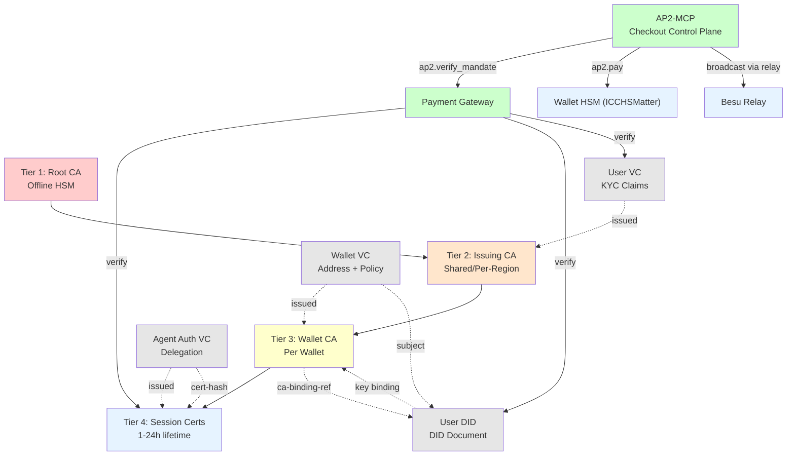

# didKYC CA-Bound Certificate Identity and Policy-Enforced Checkout Architecture

## Purpose
This document defines a production-ready trust architecture for didKYC agentic micropayment systems. It combines decentralized identity controls with CA-backed trust operations and provides an implementation baseline for identity verification, wallet address binding, delegated agent authorization, AP2-MCP policy-enforced checkout execution, and audit-grade compliance evidence.

The design uses a 4-tier PKI model that is DID and VC compatible, with AP2-MCP as the checkout control plane.

## 1. Design Principles

1. Decentralized identity and centralized trust are complementary, not conflicting.
2. DID remains subject-controlled identity.
3. VC is the source of KYC claim attestation.
4. CA cert chain is trust anchor evidence for issuer and key lifecycle governance.
5. Payment authorization must pass dual verification: cert chain plus DID/VC checks.
6. Checkout execution must be fail-closed via AP2-MCP using mandatory verify and pay stages.

## 1.1 Trust Hierarchy Block Diagram

```
┌─────────────────────────────────────────────────────────────────┐
│                  DIDKYC Trust Architecture                       │
└─────────────────────────────────────────────────────────────────┘

                    PKI HIERARCHY
                    
    ┌──────────────────────────────────────┐
    │  Tier 1: Payment Gateway Root CA     │
    │  (Offline HSM + Ceremony)            │
    └──────────────────┬───────────────────┘
                       │ signs
                       ▼
    ┌──────────────────────────────────────┐
    │ Tier 2: Gateway Issuing CA           │
    │ (Shared / Per-Region)                │
    └──────────────────┬───────────────────┘
                       │ signs
                       ▼
    ┌──────────────────────────────────────┐
    │ Tier 3: User Wallet CA               │
    │ (Per Wallet Instance)                │
    └──────────────────┬───────────────────┘
                       │ signs
                       ▼
    ┌──────────────────────────────────────┐
    │ Tier 4: Session Certs                │
    │ (Agent / Short-lived 1-24h)          │
    └──────────────────────────────────────┘


                DID/VC BINDING LAYER
                
    ┌────────────────────────────────────────┐
    │      User DID (DID Document)           │
    │  Verification methods + CA binding ref │
    └─────────────────┬──────────────────────┘
                      │ bound to
    Tier 3 Wallet CA  │  Tier 2 Issuing CA
    public key ◄──────┘
                      │ subject of
                      ▼
    ┌────────────────────────────────────────┐
    │  VCs: User VC, Wallet VC,              │
    │  Agent Authorization VC                │
    │  (Contains KYC claims + bindings)      │
    └────────────────────────────────────────┘


                VERIFICATION FLOW
                
    Agent → | Submit cert + DID + VC + proof-of-possession |
            │                                               │
            ▼                                               ▼
    ┌──────────────────────┐            ┌──────────────────────┐
    │ Gateway Verifies:    │            │ Dual Verification:   │
    │ • Cert chain OK      │ ◄─────────►│ • PKI chain valid    │
    │ • Revocation status  │            │ • DID/VC binding OK  │
    │ • Policy scope       │            │ • Address matches    │
    └──────────────────────┘            │ • Policy constraints │
                                        └──────────────────────┘
                                               │
                                               ▼
                                        ✓ AP2-MCP Executes Sign and Relay
```

## 1.2 Architecture Relationship Diagram (Mermaid)



**Mermaid Legend:**
- Solid arrows → : PKI signing hierarchy
- Dotted arrows -.-> : DID/VC/key bindings
- Tiers A–D: Certificate authority chain
- Objects E–H: DID and VC credentials
- Gateway I: Verification entry point

## 2. 4-Tier Trust Hierarchy and Roles

### Tier 1: Payment Gateway Company Root CA
- Root trust anchor for the gateway domain.
- Certificate issued by an authorized CA institution.
- Kept in offline HSM with ceremony-based key management.
- Used only for signing Tier 2 issuing CA certs and trust updates.

### Tier 2: Gateway User Issuing CA (Shared or Per-Region)
- Shared issuing CAs managed by gateway, partitioned by region, risk class, or product line.
- Replaces per-user immediate CA model to avoid CA explosion.
- Signs Tier 3 wallet CAs and user identity-related credentials.
- Enforced via strict certificate profiles and policy OIDs.

### Tier 3: User Wallet CA (Per Wallet)
- One wallet CA per wallet instance, signed by Tier 2.
- Binds wallet DID, wallet key material, custody policy hash, and wallet profile metadata.
- Issues Tier 4 short-lived certs for agent sessions and browser-mediated contexts.

### Tier 4: Agent or Session End-Entity Certificates (Short-Lived)
- Per agent, per session, or per delegated key context.
- Recommended lifetime: 1 to 24 hours depending on micropayment frequency and risk policy.
- Contains spending scope, validity window, and policy hash references.

## 3. DID, VC, and CA Binding Model

To prevent trust-model drift, every payment flow must prove the following bindings:

1. DID document verification material matches cert public key or key hash reference.
2. VC subject is the DID being presented.
3. VC proof links to key material controlled by the same subject.
4. Certificate chain thumbprints match references in DID document or VC binding fields.
5. Wallet address in VC equals transaction sender.

### 3.1 DID Document Binding Requirements
DID documents should include standard verification methods plus CA binding metadata.

#### did:kyc Subject Naming Rule
Use a single canonical DID shape across the architecture:

```text
did:kyc:<role>:<subject-id>
```

Role vocabulary for this project:
- `payment` for payment gateways and regulated issuer/verifier entities.
- `wallet` for wallet-bound user identities and policy subjects.
- `agent` for delegated software agents and runtime principals.

Conventions:
- Keep identifiers lowercase and stable.
- Use fragments only for keys and services, for example `#ca-issuer-key`, `#wallet-key`, `#browser-session-key`, and `#agent-runtime`.
- Keep certificate tier, session scope, and authorization lifetime in VC claims and PKI bindings, not in the DID subject prefix.

Example shape:

```json
{
   "id": "did:kyc:wallet:user123",
  "verificationMethod": [
    {
         "id": "did:kyc:wallet:user123#key-1",
      "type": "JsonWebKey2020",
         "controller": "did:kyc:wallet:user123",
      "publicKeyJwk": { "kty": "EC", "crv": "P-256", "x": "...", "y": "..." }
    },
    {
         "id": "did:kyc:wallet:user123#ca-binding",
      "type": "X509CertificateBinding",
         "controller": "did:kyc:wallet:user123",
      "x5cSha256": ["sha256:...", "sha256:..."],
      "issuerPolicyOid": "1.2.3.4.5.6.7"
    }
  ]
}
```

Note:
- Keep standard DID verification methods for interoperability.
- Treat CA binding fields as extension metadata for enterprise trust validation.

### 3.2 VC Binding Requirements
VCs should include claim proof and CA trust references.

- KYC claims are attested by a CA-trusted issuer.
- VC signature proves claim integrity.
- CA chain proves issuer trust and governance status.

Optional advanced mode:
- Add selective disclosure and ZKP proofs for privacy-sensitive relying parties.

### 3.3 AP2-Style Mandate Binding Requirements
To align with AP2-style verifiable intent, every agent-initiated payment should present a cryptographically signed mandate.

Mandatory mandate fields:
- `mandate_id` as unique immutable identifier.
- `wallet_did`, `agent_did`, and `merchant_id` or merchant DID.
- `allowed_actions` and payment purpose.
- `max_amount`, `currency`, and optional per-transaction or cumulative limits.
- `valid_from`, `valid_until`, and replay-protection nonce.
- `policy_hash` and optional policy version reference.
- `proof` containing signer key reference and detached or embedded signature.

Binding requirements:
1. Mandate signer must resolve to wallet-controlled verification material.
2. Mandate `wallet_did` must match Wallet VC subject.
3. Mandate `agent_did` must match Agent Authorization VC subject.
4. Mandate constraints must be equal to or stricter than VC-delegated scope.
5. Mandate hash should be stored in audit events and optionally anchored on-chain.

Recommended profile:
- Use AP2-style field naming and canonicalization.
- Keep transport-neutral schema so the same mandate can be carried via API, wallet channel, or protocol envelope.

## 4. Issuance Processes to Meet eKYC Requirements

### 4.1 Immediate and Wallet CA Issuance (Tier 2 to Tier 3)
This stage should be semi-automated with mandatory manual controls on risk triggers.

#### Automated checks
1. Identity intake with OCR or NFC parsing.
2. Face match and liveness checks.
3. Document authenticity and anti-tampering checks.
4. Sanctions, PEP, and adverse media screening.
5. Device and environment risk scoring.
6. Policy pre-check against jurisdiction and product constraints.

#### Manual controls
1. Maker-checker approval for medium or high-risk scores.
2. Mandatory review for watchlist hits, identity mismatch, or suspicious patterns.
3. Enhanced due diligence workflow for high-risk users.
4. Reviewer identity, decision reason code, and evidence captured for audit.

#### Automated issuance and binding
1. Generate or import wallet CA keys in secure element, HSM, or TEE.
2. Apply fixed certificate template with policy OID, key usage, path constraints, and validity.
3. Sign wallet CA cert from Tier 2 issuing CA.
4. Issue or update User VC and Wallet VC with DID and cert thumbprint references.

### 4.2 End-Entity Issuance (Tier 3 to Tier 4)
This stage should be heavily automated after trust establishment.

#### Automated eligibility checks
1. Parent wallet CA status is active.
2. User and wallet VCs are active and not revoked.
3. Session policy is valid for amount, merchant scope, and time window.
4. Agent proof-of-possession challenge succeeds.

#### Automated issuance
1. Issue short-lived end-entity cert.
2. Add policy hash and delegated authority scope.
3. Register issuance event for traceability.

#### Runtime policy enforcement
1. Enforce per-transaction policy checks before signing.
2. Trigger step-up verification on anomalies.
3. Auto-expire or revoke on policy breach.

## 5. Verification Method (Gateway, Wallet, Subject)

### 5.1 Gateway Verification (All-Verifier)
For every payment initiation:

1. Verify cert chain:
   - Tier 4 end-entity to Tier 3 wallet CA
   - Tier 3 wallet CA to Tier 2 issuing CA
   - Tier 2 issuing CA to Tier 1 root CA
2. Verify cert status:
   - Tier 4 primarily short-lived validity plus status check where available
   - Tier 2 and Tier 3 via OCSP and CRL
3. Verify DID integrity:
   - DID resolution success and key alignment with presented proof
4. Verify VC integrity:
   - Issuer trust, signature validity, credential status, nonce, expiry
5. Verify binding consistency:
   - DID to key
   - VC subject to DID
   - VC binding references to cert chain hashes
   - Wallet address claim to transaction sender
6. Verify mandate integrity and intent:
   - Mandate signature validity and signer authority
   - Mandate scope/amount/time-window compliance
   - Mandate nonce and replay protection
   - Mandate linkage to wallet DID, agent DID, and merchant context
7. Verify policy controls:
   - Daily limit, merchant whitelist, delegated action scope, validity window

### 5.2 AP2-MCP Execution Verification
Before server-side signing and relay broadcast:

1. Verify agent cert chain to wallet CA.
2. Verify agent DID proof-of-possession.
3. Verify agent authorization VC scope.
4. Verify AP2-style mandate integrity, scope, and replay constraints.
5. Re-run fail-closed checks in ap2.pay before Wallet HSM (ICCHSMatter) signing.
6. Broadcast only through approved Besu relay routes.

### 5.3 Subject-Side Proof Pack
Agent should present:

- Tier 4 cert chain evidence
- DID proof-of-possession
- Agent authorization VC
- AP2-style signed mandate
- Session nonce response

Browser-mediated flow should present:

- TLS evidence and session integrity artifacts

## 6. Revocation and Status Strategy

1. Tier 4:
- Prefer short-lived certs plus nonce-based anti-replay.
- Use OCSP where ecosystem supports it.

2. Tier 2 and Tier 3:
- Use OCSP plus CRL as mandatory baseline.

3. Transparency enhancement:
- Publish revocation commitments to on-chain registry (for example Besu smart contract) without exposing PII.

4. Operational SLA:
- Define maximum revocation propagation times and status cache freshness windows.

## 7. Privacy and Data-Minimization Strategy

1. Do not expose full cert chain to merchants unless required.
2. Expose only required proof artifacts and trust references.
3. Keep PII off-chain; anchor hashes and references only.
4. Rollout recommendation:
- Phase 1: JWT VC or SD-JWT VC for broad interoperability.
- Phase 2: BBS+ selective disclosure for high-privacy lanes.

## 8. Security Architecture Requirements

1. Tier 1 root keys in offline HSM with ceremony controls.
2. Tier 2 keys in cloud HSM or TEE-backed signing service.
3. Tier 3 and Tier 4 keys in secure element, wallet enclave, or delegated TEE signer.
4. Enforce key rotation and cryptographic agility at all tiers.
5. Enforce anti-replay controls: nonce, timestamp, bounded validity windows.

## 9. Scalability and Cost Controls

1. Use certificate templates and policy profiles to standardize issuance.
2. Use automated provisioning with Step-CA or Vault PKI.
3. Monitor issuance rates and anomaly spikes to prevent abuse.
4. Partition Tier 2 issuing CAs by region and risk class for operational isolation.

## 10. Minimum Claims and Metadata

### 10.1 User VC
- sub: user DID
- kyc_level
- jurisdiction
- issued_at
- expires_at
- issuer_ca_chain_hash

### 10.2 Wallet VC
- sub: wallet DID
- parent_sub: user DID
- wallet_address
- custody_type
- daily_limit
- allowed_use
- wallet_ca_chain_hash

### 10.3 Agent Authorization VC
- sub: agent DID
- wallet_sub: wallet DID
- permitted_actions
- max_amount
- validity_window
- policy_hash
- end_entity_cert_hash

### 10.4 AP2-style Mandate
- mandate_id
- wallet_did
- agent_did
- merchant_id_or_did
- allowed_actions
- max_amount
- currency
- validity_window
- nonce
- policy_hash
- mandate_signature

## 11. Compliance and Audit Package

For each payment, store:

1. Certificate chain fingerprints and status evidence.
2. DID resolution snapshots.
3. VC verification results and credential status proofs.
4. Policy decision logs with allow or deny reason codes.
5. Transaction hash, settlement timestamp, and trace ID.
6. eKYC evidence references and reviewer decision records where applicable.

## 12. didKYC Positioning Statement

Recommended wording:

KYC claims are attested by a CA-trusted issuer and expressed in VCs bound to DID-controlled keys. This creates a didKYC model where decentralized identity ownership and centralized trust governance are combined without conflict.

## 13. End-to-End Flow Summary

1. User completes eKYC.
2. Tier 2 issuing CA and issuer services attest identity and issue User VC.
3. Wallet is provisioned with Tier 3 wallet CA and Wallet VC.
4. Agent session receives short-lived Tier 4 cert and authorization VC.
5. Wallet issues or confirms AP2-style signed mandate for agent intent.
6. Agent submits preflight verification through ap2.verify_mandate.
7. AP2-MCP performs dual verification: PKI chain, DID/VC bindings, and mandate integrity/scope checks.
8. Agent requests execution through ap2.pay; AP2-MCP re-validates fail-closed policy controls.
9. AP2-MCP invokes Wallet HSM (ICCHSMatter) server-side signing and broadcasts through approved Besu relay.
10. Transaction settles and audit package is persisted.

This architecture is designed for secure, scalable, and compliance-aligned didKYC agentic micropayment operations.
