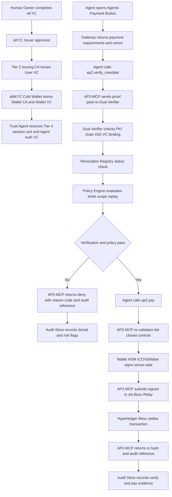

# DID VC Flow Diagram

```mermaid
flowchart TD
  A1[Human Owner completes eKYC] --> A2[eKYC Issuer approves]
  A2 --> A3[Tier 2 Issuing CA issues User VC]
  A3 --> A4[didKYC Cold Wallet stores Wallet CA and Wallet VC]
  A4 --> A5[Trust Agent receives Tier 4 session cert and Agent Auth VC]

  B1[Agent opens Agentic Payment Button] --> B2[Gateway returns payment requirements and nonce]
  B2 --> B3[Agent calls ap2.verify_mandate]
  B3 --> B4[AP2-MCP sends proof pack to Dual Verifier]
  B4 --> B5[Dual Verifier checks PKI chain DID VC binding]
  B5 --> B6[Revocation Registry status check]
  B6 --> B7[Policy Engine evaluates limits scope replay]

  B7 --> C1{Verification and policy pass}
  C1 -- No --> C2[AP2-MCP returns deny with reason code and audit reference]
  C2 --> C3[Audit Store records denial and risk flags]

  C1 -- Yes --> D1[Agent calls ap2.pay]
  D1 --> D2[AP2-MCP re-validates fail-closed controls]
  D2 --> D3[Wallet HSM ICCHSMatter signs server-side]
  D3 --> D4[AP2-MCP submits signed tx via Besu Relay]
  D4 --> D5[Hyperledger Besu settles transaction]
  D5 --> D6[AP2-MCP returns tx hash and audit reference]
  D6 --> D7[Audit Store records verify and pay evidence]
```
